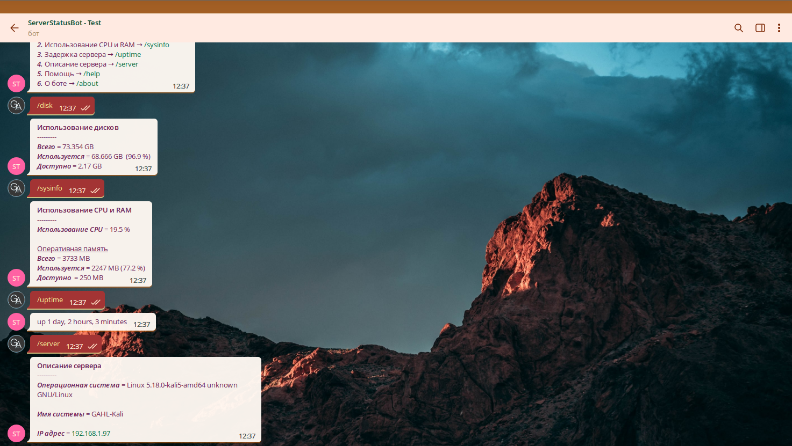

<p align="center">
	
	<br><br>
	<h1 align="center">
		Server Status Bot
		<p></p>
		
		
		
		
		
		
	</h1>
	<h2 align="center">:robot: Telegram бот для проверки статуса сервера</h2>
<hr>
</p>

<p></p>

# :page_facing_up: Описание

### :robot: Telegram бот для проверки статуса сервера:
- Информация об использовании процессора и оперативной памяти
- Информация об использовани места на жёстких дисках
- Информация о сервере
- Получение ответа от сервера для проверки работоспобности (аптайм)

<br>

# :memo: Версии

### :heavy_check_mark: `Последняя версия`
## **Версbя v1.0.0**

### Добавлено
- 7 команд
- файлы [настроек](https://github.com/GORAlexComp/ServerStatusBot) и [информации](https://github.com/GORAlexComp/ServerStatusBot)

### Исправлено
#### `Исправления отсутствуют`

<br>

### Инструкция использования тут: *https://github.com/GORAlexComp/ServerStatusBot*

<br>

```py
	Автор: @GORAlexComp
	Telegram: t.me/ssbt_bot
```
